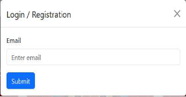
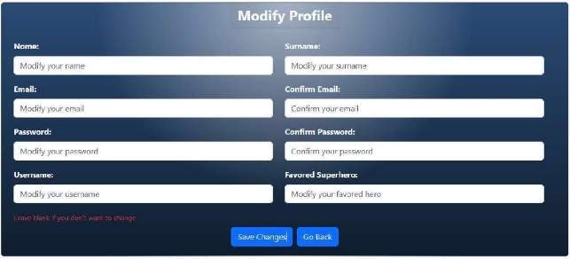

PREMESSA l'indice del readme è stato convertito male ed è molto brutto visivamente, se volete uno più navigale è presente sia nel sito che nel file Documentazione.pdf
INOLTRE la API key per il db marvel e quella per il db di mongo non sono presenti.

Documentazione Progetto di Tecnologie e Linguaggi per il Web: 

**ALBUM DELLE FIGURINE DEI SUPEREROI** 

[1 Introduzione  2 ](#_page1_x54.00_y465.92)[Panoramica del Sito  2 ](#_page1_x54.00_y504.92)[Requisiti Software  2 ](#_page1_x54.00_y671.92)[Dipendenze Node.js  3](#_page2_x54.00_y92.92)

[2 Panoramica del sito  3 ](#_page2_x54.00_y474.92)[Architettura  3 ](#_page2_x54.00_y513.92)[Tecnologie Utilizzate  3 ](#_page2_x54.00_y695.92)[Mappa del sito di navigazione  4](#_page3_x54.00_y192.92)

[3 Gestione profilo utente  4 ](#_page3_x54.00_y642.92)[Autenticazione e accesso  4 ](#_page3_x54.00_y681.92)[Autenticazione  4 ](#_page3_x54.00_y709.92)[Accesso  5 ](#_page4_x54.00_y353.92)[Processo di registrazione  6 ](#_page5_x54.00_y346.92)[Visualizzazione Info Utente  7 ](#_page6_x54.00_y361.92)[Logout  8 ](#_page7_x54.00_y383.92)[Modifica ed eliminazione del profilo  8 ](#_page7_x54.00_y705.92)[Modifica  8 ](#_page7_x54.00_y729.92)[Eliminazione del profilo  9](#_page8_x54.00_y583.92)

[4 Gestione dei Pacchetti di Figurine  10 ](#_page9_x54.00_y356.92)[Sistema di acquisizione crediti  10 ](#_page9_x54.00_y395.92)[Premessa importante  10 ](#_page9_x54.00_y423.92)[Acquisto di Hero Points  10 ](#_page9_x54.00_y607.92)[Acquisto dei pacchetti di figurine  11 ](#_page10_x54.00_y292.92)[Apertura pacchetti  13 ](#_page12_x54.00_y70.92)[Apertura del Pacchetto  13 ](#_page12_x54.00_y371.92)[Show delle Figurine  14 ](#_page13_x54.00_y106.92)[Processo di Spacchettamento  14 ](#_page13_x54.00_y249.92)[Visualizzazione Collezione  14 ](#_page13_x54.00_y526.92)[Caricamento e Visualizzazione della Collezione  14](#_page13_x54.00_y612.92)

[Barra di Ricerca  15 ](#_page14_x54.00_y397.92)[Organizzazione Figurine  16 ](#_page15_x54.00_y487.92)[Sistema di Determinazione della Rarità delle Figurine  16 ](#_page15_x54.00_y510.92)[Calcolo della Rarità delle Figurine  16 ](#_page15_x54.00_y659.92)[Sistema di Rarità Dinamica e Fluttuazione del Mercato  17](#_page16_x54.00_y147.92)

[5 Dettagli dei Supereroi  17 ](#_page16_x54.00_y388.92)[Visualizzazione supereroi (homepage)  17 ](#_page16_x54.00_y427.92)[Pagine di dettaglio per i supereroi  18](#_page17_x54.00_y720.92)

[6 Marketplace di Figurine  19 ](#_page18_x54.00_y702.92)[Marketplace  19 ](#_page18_x54.00_y741.92)[Creazione di offerte Sell  21 ](#_page20_x54.00_y419.92)[Acquisto di offerte  22 ](#_page21_x54.00_y379.92)[Easter Egg: General Grievous  23 ](#_page22_x54.00_y285.92)[Gestione ordini  23](#_page22_x54.00_y599.92)

[7 Struttura Database  24 ](#_page23_x54.00_y403.92)[Organizzazione delle Collection  24 ](#_page23_x54.00_y442.92)[Organizzazione Id  26](#_page25_x54.00_y157.92)

[8 Sicurezza e Integrità  26 ](#_page25_x54.00_y637.92)[Autenticazione tramite cookie  27 ](#_page26_x54.00_y176.92)[Swagger  28](#_page27_x54.00_y70.92)

[9 Test e Validazione  28 ](#_page27_x54.00_y151.92)[Test delle funzionalità (public site)  28 ](#_page27_x54.00_y190.92)[Tracciamento e risoluzione bug (logs)  28 ](#_page27_x54.00_y424.92)[Console Personalizzata  29 ](#_page28_x54.00_y537.92)[10 Credits e ringraziamenti  30](#_page29_x54.00_y234.92)

1 Introduzione 

Panoramica del Sito 

Il sito "Marvel Stars" è una piattaforma web destinata agli appassionati di supereroi Marvel che prende un po’ spunto dal nuovo gioco pokémon Pokémon Trading Card Game Pocket per quanto riguarda la componente di collezione delle figurine, e da Steam marketplace dove si scambiano per soldi i vari item ottenuti sulla piattaforma.  

La piattaforma punta ad appagare la passione per i supereroi, consentendo agli utenti di collezionare figurine digitali dei loro eroi preferiti. Gli appassionati possono acquistare pacchetti di figurine per arricchire  la propria  collezione e  partecipare  a scambi  con altri  utenti.  Un  semplice  click  può trasformare l'innocente hobby in una vera e propria sfida: ingrandire la propria collezione spendendo meno ***euro*** possibile. 

Requisiti Software 

Ecco un elenco dettagliato dei requisiti software e delle dipendenze (moduli Node.js) che dovresti installare: 

1. **Node.js**: Ambiente di esecuzione server-side per JavaScript. 
1. **MongoDB**: Sistema di gestione del database NoSQL utilizzato per archiviare i dati delle figurine e degli utenti, con anche MongoDbCompass (opzionale). 
3. **Postman (opzionale):** Postman è una piattaforma per lo sviluppo e il testing di API.** 

Dipendenze Node.js 

Per supportare le funzionalità del sito, saranno necessari i seguenti pacchetti Node.js: 

- **express**:  Framework  web  minimalista  e  flessibile  per  Node.js,  utilizzato  per  gestire  le richieste  HTTP,  il  Routing,  ecc. 

  

- **cors**: Middleware per abilitare CORS (Cross-Origin Resource Sharing), permettendo al frontend  di  fare  richieste  al  server  da  domini  diversi. 

  

- **swagger-autogen**: Genera automaticamente un file swagger.json per documentare l'API.  

  

- **swagger-ui-express:**  Middleware  per  servire  la  documentazione  dell'API  generata  da Swagger  in  un'applicazione  Express.

  

- **mongodb**: Driver ufficiale MongoDB per Node.js, permette di interagire facilmente con il database  MongoDB.

  

2 Panoramica del sito

Architettura 

Il sito è costruito su un'architettura client-server, con un frontend realizzato in HTML5, CSS3 e JavaScript per garantire una user experience fluida e reattiva, e un backend sviluppato in NodeJS che interagisce con una base di dati MongoDB.. 

- **Frontend**:  Implementa  l'interfaccia  utente  del  sito  e  gestisce  l'interazione  con  l'utente. Utilizza framework moderni come Bootstrap che migliora la reattività e l'esperienza utente. 
- **Backend**: NodeJs ottimo per gestisce la logica di business, l'elaborazione dei dati e le interazioni con il database. 
- **Database**: MongoDB, un database NoSQL, è utilizzato per la sua flessibilità nel gestire schemi di dati variabili e la sua scalabilità. 

Tecnologie Utilizzate 

- **HTML5 e CSS3**: Per una struttura solida e uno stile visivo accattivante. 
- **Bootstrap**: Per uno stile visivo più pulito e reattivo visto la sua semplicità e praticità. 
- [Animate.css,](https://animate.style/)[ Hover.css,](https://ianlunn.github.io/Hover)[ Vanilla-tilt.js:](https://micku7zu.github.io/vanilla-tilt.js) Per aggiungere qualche animazione e dinamicità alla pagina. 
- **JavaScript**: Per interattività client-side. 
- **NodeJS**: Per il server-side scripting e la gestione delle API. 
- **MongoDB**: Per la memorizzazione e il recupero efficiente dei dati. 
- **RESTful API**: Per facilitare la comunicazione tra il frontend e il backend. 

Mappa del sito di navigazione 

La mappa del sito è intuitiva e consente facile accesso a tutte le funzionalità principali: Il sito si divide in due versioni: 

1. **Unlogged**:  Parte  del  sito  destinata  agli  utenti  che  non  hanno  ancora  fatto  l’accesso,  che consente comunque di esplorare alcune funzionalità del sito ma senza poter agire. 
   1. Homepage: Mostra l’elenco delle figurine disponibili nell’applicazione e offre accesso immediato alle funzionalità principali tramite la barra di navigazione come lo Shop e il Marketplace, mentre a sinistra il pulsante di login. 
   1. Shop: Qui si possono visualizzare i vari pacchetti di figurine e i crediti virtuali. 
   1. Marketplace: Qui si può visualizzare ogni figurina con i suoi rispettivi trade. 
1. **Logged**: parte destinata agli utenti loggati che posso usufruire di tutta la parte unlogged più la parte dedicata alle azioni che richiedo l’autenticazione. 
- Homepage: Stesso dell’unlogged ma mostra in più nella barra di navigazione la tab Inventario e a sinistra le opzioni utente. 
- Shop: Uguale alla parte unlogged solo che i pacchetti e i crediti sono interagibili e acquistabili. 
- Marketplace: Uguale alla parte unlogged con la differenza che ora puoi interagire con i trade per comprare o piazzare ordini. 
- Inventario: Sezione dedicata allo sbusto dei pacchetti e alla visualizzazione della propria collezione personale. 
- Gestione profilo: questa sezione comprende 
- **Visualizzazione del profilo**: che offre la possibilità di visualizzare i propri dati utente e di modificarli oppure di eliminare l’account. 
- **Api Swagger**: è un riferimento allo swagger con cui poter interagire per fare richieste  all’API  (ATTENZIONE!  è  necessario  essere  autenticati  per  poterla utilizzare). 
- **Pagine Help**: contiene semplicemente questa stessa documentazione, per poter informare l’utente anche sul funzionamento della piattaforma. 
- **Logout**: semplice pulsante per eseguire il logout dalla piattaforma che reindirizza alla homepage della sezione unlogged. 

3 Gestione profilo utente 

Autenticazione e accesso 

*Autenticazione* 

Ogni  volta  che  viene  caricata  una  pagina  nella  directory  logged,  viene  chiamata  la  funzione *checkIfLogged()* per verificare lo stato di autenticazione dell'utente. Questa funzione controlla la presenza di un cookie denominato *token*. Se il cookie è presente, viene effettuata una richiesta alla route di backend */users/checkLogged* per verificare la validità del cookie. 

Nel backend, viene effettuato un confronto tra il valore del token presente nel cookie dell'utente e quello memorizzato nel server. Se il token risulta valido e coincide con quello registrato lato server, la funzione  *cookieChecking()*  restituisce *true*,  consentendo  l'autenticazione dell'utente.  In  caso contrario, l'accesso viene negato e l'utente verrà reindirizzato alla pagina *unlogged/homepage.html*. 

Il funzionamento dettagliato della validazione del cookie nel backend, inclusi i controlli di integrità e sicurezza, sarà spiegato approfonditamente nella sezione dedicata: Capitolo 8. 

***Script di reference: index.js, logged/script.js*** 

*Accesso* 

Al caricamento di una qualsiasi pagina presente nella dir logged viene chiamata una funzione *checkIfLogged()* che ha il compito di controllare se tra i cookie dell’utente ne esiste uno con il nome (token), se lo trova fa una chiamata alla route */users/checkLogged* per controllare se effettivamente l’utente possiede un cookie valido. Nel backend vengono fatti controlli tra il cookie dell’utente e quello salvato  sul  server  (maggiori  dettagli  in  accesso),  se  il  cookie  è  accettato  la  funzione *coockieChecking()* ritorna true, e l’utente può essere autenticato. 

L'accesso è gestito tramite un modale di autenticazione che richiede inizialmente l'inserimento dell'indirizzo email (non case sensitive). Al momento del *submit*, viene prima controllato che la stringa sia una mail, se lo è richiamata la funzione *checkSignIn()*, la quale effettua una richiesta alla route */users/checkEmail* per verificare la presenza di un utente associato a quell'indirizzo nel DB. 

- **Se l'email è trovata**, il modale si aggiorna mostrando un nuovo campo per l'inserimento della password. 
- **Se  l'email  non  è  trovata**,  il  modale  mostrerà  invece  la  sezione  di  registrazione  per consentire all'utente di creare un nuovo account. 

  Una  volta  inserita  la  password  e  fatto  il  *submit*  del  modulo,  viene  chiamata  la  funzione *loginSequence()*. Questa funzione si occupa di verificare che entrambi i campi siano compilati; in caso contrario, mostra degli *alert()* specifici. Se il controllo viene superato, la password viene hashata, e successivamente la funzione  *loginFunction()* esegue una richiesta  *POST* alla route */users/login*. 

Nel backend, viene effettuata una verifica sulla corrispondenza tra la password hashata ricevuta e quella  memorizzata  nel  DB.  Se  la  verifica  ha  esito  positivo,  il  sistema  genera  due  cookie  di autenticazione: 

1. **Un cookie** che viene inviato al browser dell'utente per gestire la sessione. 
1. **Un token server-side** memorizzato sul server per un ulteriore controllo di corrispondenza durante le richieste successive. 

Se  l’utente  supera  tutti  i  controlli  verrà  autenticato  altrimenti  verrà  notificato  del  fallimento dell’operazione di login sempre tramite *alert()*. 

***Script di reference: index.js, logged/script.js, unlogged/script.js*** 

Processo di registrazione 

Come già accennato nel paragrafo precedente se l’email non viene trovata viene mostrato il form di registrazione alla piattaforma, una volta fatto il *submit* viene chiamata la funzione *registrSequence()* che prima fa controlli di integrità sui dati del form e se li passa hasha la password e chiama la funzione *registrFunction()* che fa una chiamta alla route */users/registr*. 

Qui vengono inizializzate tutte le variabili che comporrano il nuovo utente, in particolare gli id per i riferimenti alle varie collection, la data di creazione, il supereroe preferito inizialmente impostato a *null* e soprattutto i 5 pacchetti normali omaggio necessari per garantire all’utente la possibilità di non dover acquistare HeroPoints (HP) per arricchirsi. Infine viene inizializzato il nuovo utente nel DB e se ha successo al rientro viene direttamente effettuato il login chimando l’apposito funzione. 

Come descritto in precedenza, se l'indirizzo email inserito non viene trovato nel database, il modale si aggiorna automaticamente per mostrare il modulo di registrazione alla piattaforma. Al momento del *submit* del modulo, viene chiamata la funzione *registrSequence()*, che esegue una serie di controlli di integrità sui dati (come il formato dell'email, la corrispondenza tra le password e la presenza di tutti i campi). 

Se i controlli vengono superati con esito positivo, la password viene hashata. Successivamente, la funzione *registrFunction()* effettua una richiesta *POST* alla route */users/registr*. 

Nel backend, il sistema procede con l'inizializzazione delle variabili necessarie per la creazione del nuovo utente, in particolare: 

- **ID univoci** per i riferimenti alle varie collection del database. 
- **Data di creazione** dell'account. 
- **Supereroe preferito**, inizialmente impostato a null. 
- **5 pacchetti normali omaggio**, concessi per consentire di iniziare la propria collezione senza dover acquistare HeroPoints (HP) fin da subito. 

Una volta completata con successo l'inizializzazione, il nuovo utente viene registrato nel database. Se  l'operazione  ha  esito  positivo,  il  sistema  procede  automaticamente  al  login  dell'utente richiamando la funzione citata nel paragrafo precedente, garantendo una UX fluida e immediata dopo la registrazione. 

Il funzionamento dettagliato della generazione degli ID nel DB, sarà approfondita nella sezione dedicata: Capitolo 7. 

***Script di reference: index.js, logged/script.js, unlogged/script.js*** 

Visualizzazione Info Utente 

Quando l'utente accede alla pagina delle profile info, vengono visualizzati tutti i suoi dati personali. Sotto queste informazioni sono presenti due pulsanti con funzionalità specifiche: 

1. **Modifica Account:**  Consente  all'utente di  modificare  le proprie  informazioni,  inclusa  la selezione del supereroe preferito. La scelta del supereroe preferito ha un impatto  sulla piattaforma in quanto, una volta selezionato un supereroe, l'immagine del supereroe verrà automaticamente impostata come icona profilo ovunque sulla piattaforma. 
1. **Eliminazione  dell'Account:**  Permette  all'utente  di  eliminare  definitivamente  il  proprio account e i dati ad esso associati con tanto di modale di conferma. 

**Sezione Amministratore (Nascosta)** 

Al di sotto di questi pulsanti esiste una **sezione nascosta**, visibile e accessibile esclusivamente all'utente con privilegi di admin (userId 100001). Questa sezione consente all'amministratore di eseguire l'accesso come un altro utente specificando l'userId nell’ apposito campo. 

Quando l'amministratore inserisce un userId e conferma l'azione: 

- viene inviata una richiesta alla route */sU/getUserAccess*. 
- Il backend verifica se l'utente possiede effettivamente privilegi amministrativi, controllando lo userId nel cookie. 
- Se l'autenticazione è valida: 
- Viene generato un nuovo **cookie di autenticazione** contenente l'userId dell'utente specificato. 
- Il  token  associato  viene  aggiunto  alla  lista  dei  token  autenticati  sul  server  per consentire l'accesso. 
- Il nuovo cookie viene inviato al browser del client e la pagina viene automaticamente ricaricata. 

Dopo il caricamento, l'amministratore risulterà a tutti gli effetti loggato come l'utente selezionato, potendo interagire con il sito con i permessi e i dati di quell'account. 

***Script di reference: index.js, account.js*** 

Logout 

Quando l'utente preme il pulsante di logout, viene invocata la funzione  *logoutSequence()*, che effettua una richiesta alla route */users/logout* del backend. 

Nel backend, viene: 

- **Rimosso il cookie di autenticazione** dal browser dell'utente. 
- **Eliminato il token di autenticazione** dalla lista dei token attivi memorizzati lato server, revocando così l'accesso per quella sessione specifica. 

Se la richiesta al server viene completata con successo, l'utente viene automaticamente reindirizzato alla pagina *unlogged/homepage.html*. 

***Script di reference: index.js, logged/script.js*** 

Modifica ed eliminazione del profilo 

*Modifica* 

Dopo che l'utente ha compilato il modulo di modifica del profilo e cliccato il pulsante di *submit*, viene chiamata la funzione *updateProfile()*, che esegue una serie di controlli di integrità sui dati inseriti. 

Se i controlli vengono superati, viene inviata una richiesta alla route */users/editProfile*. **Gestione lato backend:** 

Nel  backend,  vengono  aggiornati  esclusivamente  i  dati  effettivamente  inviati  per  la  modifica, mantenendo invariati gli altri. 

**Esiti della modifica:** 

- **Modifica avvenuta con successo:** 
- Un  **toast  verde**  di  conferma  apparirà  nell'interfaccia,  notificando  l'avvenuto aggiornamento. 
- Dopo  pochi  secondi,  l'utente  verrà  automaticamente  reindirizzato  alla  pagina *logged/account.html* per visualizzare il profilo aggiornato. 
- **Errore durante la modifica:** 
- Un  **toast  rosso**  verrà  mostrato,  notificando  l'impossibilità  di  completare l'aggiornamento. 
- In questo caso, l'utente non verrà reindirizzato e potrà correggere i dati o tentare nuovamente l'invio. 

*Eliminazione del profilo* 

Una volta cliccato il pulsante per eliminare l’account apparirà un modale di conferma, se si decide di  confermare  verrà  chiamata  la funzione  *deleteAccount()*  che  invierà  una  richiesta alla  route */users/delete*.  

Nel backend vengono trovati tutti i dati dell’utente associati al suo account ed eliminati dal DB. Per ogni oggetto da eliminare dal DB vengono svolti controlli se le delete sono avvenute con successo 

- meno. Infine, viene eliminato il cookie all’utente e dal server. 

Se  l’eliminazione  ha  avuto  esiti  positivi  *l’utente  viene  reindirizzato***  alla  pagina *unlogged/homepage.*html. 

***Script di reference: index.js, account.js, modifyAccount.js*** 

4 Gestione dei Pacchetti di Figurine 

Sistema di acquisizione crediti 

*Premessa importante* 

La piattaforma per mia scelta adotta un approccio **non totalmente pay-to-win**, puntando a garantire un'esperienza senza il necessario bisogno di spendere **euro** in cambio di crediti virtuali (HP). Per questo  motivo,  ogni  nuovo  utente  riceve  **5  pacchetti  di  figurine  gratuiti**  al  momento  della registrazione. Con le **20 figurine** ottenute dai pacchetti iniziali, l'utente ha la possibilità di mettere in vendita alcune di esse nel marketplace, ottenendo così HP da poter reinvestiti per: 

- Acquistare nuovi pacchetti di figurine. 
- Comprare  figurine  specifiche  direttamente  dal  marketplace,  sfruttando  l'oscillazione  dei prezzi. 

Maggiori dettagli sulla variazione dei prezzi delle figurine e sull'economia del marketplace sono descritti in questo capitolo e nel capitolo 6. 

*Acquisto di Hero Points* 

I crediti virtuali della piattaforma, noti come **Hero Points (HP)**, sono acquistabili direttamente tramite l'interfaccia dello shop *logged/shop.html*. Una volta selezionata la quantità desiderata si aprirà un modale che chiederà di inserire (per finta) i dati della propria carda di credito/debito. cliccando il pulsante di *submit*, viene invocata la funzione *sendBuyRequest()*. La funzione effettua una richiesta alla route */buy/hp*. 

**Gestione Backend:** 

Il backend verifica la validità della richiesta e, se corretta, procede con l'incremento degli HP per l'utente associato. 

***Script di reference: index.js, script.js*** 

*Acquisto dei pacchetti di figurine* 

Esistono tre tipi di pacchetti di figurine: **normale**, **epico**, **leggendario**. Ciascuno di essi garantisce la possibilità di trovare almeno una figurina del corrispondete al tipo di pacchetto. 

L’acquisto avviene sempre tramite l'interfaccia dello shop *logged/shop.html*. Una volta selezionato il tipo di pacchetto e la quantità desiderata si prirà un modale di conferma. Una volta confermato con il pulsante di *submit*, viene invocata la funzione *buy()*. La funzione effettua una richiesta alla route */buy/packs*. 

  

**Gestione Backend:** 

Conduce un controllo di integrità per verificare se la spesa è sostenibile, se ha successo procede con l’aggiunta dei pacchetti all'utente. 

***Script di reference: index.js, script.js*** 

Apertura pacchetti 

I pacchetti di figurine sono accessibili e sbustabili nella sezione **Inventario** (logged/inventory.html). Al caricamento della pagina, viene mostrata una **tab** con un'opzione di selezione (radio button); **Open Packs** è la selezione predefinita, questo perchè concede del tempo necessario per il completo caricamento  della  collezione. 

Apertura del Pacchetto 

Cliccando su uno dei tre pacchetti disponibili, si aprirà un modale che consente di procedere con l'apertura. 

 

**Interazioni e Animazioni:** Le animazioni presenti nel modale sono gestite tramite un sistema chiamato **Animation Handler**: 

- **Hover del mouse all'interno del modale:** attiva l'animazione di **glow**. 
- **Uscita del mouse dal modale:** attiva l'effetto opposto, **deGlow**. 
- **Singolo click sul pacchetto:** attiva l'animazione di **shake**, che persiste finché l'utente non esce con il mouse dal modale o effettua un **doppio click**. 
- **Doppio click:** attiva l'animazione di **open** del pacchetto. 
- In alternativa, è disponibile un **bottone di apertura diretta** per avviare immediatamente l'animazione di apertura. 

Show delle Figurine 

Al termine dell'animazione di apertura, verranno mostrate **4 figurine** ottenute dal pacchetto. Ogni figurina sarà evidenziata con una **cornice colorata** che ne indica la rarità: 

- **Blu:** Comune 
- **Verde:** Rara 
- **Viola:** Epica 
- **Arancione:** Leggendaria 

Processo di Spacchettamento 

Cliccando  sul  pulsante  di  apertura  del  pacchetto,  viene  inviata  una  richiesta  alla  route */users/spacchettamento*. 

**Lato backend:** 

1. **Controlli di integrità:** Il server verifica che l'utente possieda almeno un pacchetto di quel tipo. 
1. **Estrazione delle figurine:** Vengono selezionate casualmente **4 figurine** in base ai criteri di rarità. 
1. **Aggiornamento  collezione:**  Le  figurine  estratte  vengono  aggiunte  direttamente  alla collezione personale dell'utente. 
1. **Ritorno dei dati:** Il server risponde con i dettagli delle figurine trovate, che vengono quindi mostrate sulla pagina. 

Dopo la rivelazione delle figurine, l'utente può cliccare sul pulsante  **Continue** per tornare alla schermata precedente e aprire un altro pacchetto. 

***Script di reference: index.js, inventory.js*** 

Visualizzazione Collezione 

**DISCLAIMER:** Poiché il numero massimo di figurine disponibili sulla piattaforma è di circa **1500**, e il recupero dei dati di ogni figurina richiede una richiesta separata all'API Marvel, il caricamento completo della sezione può risultare **estremamente lento**. La velocità di caricamento è direttamente proporzionale al numero di figurine possedute dall'utente. 

*Caricamento e Visualizzazione della Collezione* 

Al caricamento della pagina, viene effettuata una richiesta alla route */collection/getCollection*. Questa route restituisce l'intera collezione dell'utente, inclusi: 

- **Nome e ID della figurina.** 
- **Rarità della figurina.** 
- **Quantità posseduta.** 

Tutte le figurine presenti nella collezione vengono mostrate nella pagina con la loro **cornice colorata** che ne indica la rarità. 

*Barra di Ricerca* 

È presente una **barra di ricerca** che consente di cercare figurine specifiche in base al nome. Una volta eseguita la ricerca, tutte le figurine trovate verranno visualizzate. 

- Le figurine **non possedute** saranno mostrate in **grigio**. 
- Le figurine **già possedute** rimarranno **colorate** in base alla rarità. 

Questa distinzione visiva aiuta l'utente a comprendere rapidamente quali figurine gli mancano di un determinato personaggio. 

***Script di reference: index.js, inventory.js*** 

Organizzazione Figurine 

*Sistema di Determinazione della Rarità delle Figurine* 

Le figurine disponibili sulla piattaforma vengono ottenute direttamente tramite l['**API ufficiale della Marvel**,](https://developer.marvel.com/) mediante richieste *GET* che richiedono il passaggio di due **API keys** (una pubblica e una privata). Nel progetto sono state incluse **tre coppie di chiavi**, per due motivi principali: 

1. **Gestione del limite di richieste giornaliere:** L'API Marvel limita le richieste a **3000 al giorno** per chiave. Utilizzando 3 chiavi, è possibile aumentare la capacità complessiva di richieste, questo per sostenere il sito durante il suo periodo di testing online (vedi capitolo 9). 
1. **Efficienza nelle chiamate simultanee:** L'utilizzo di più chiavi consente l'invio parallelo di richieste, boostando i tempi di recupero delle informazioni sulle figurine. 

*Calcolo della Rarità delle Figurine* 

La rarità delle figurine è determinata dal **Numero di Apparizioni Totali (NPT)** di un personaggio in tutti i fumetti usciti. Il processo per stabilire la rarità segue i seguenti passaggi: 

- Viene calcolato l'**NPT** per ciascun personaggio. 
- I personaggi vengono ordinati in ordine **decrescente** in base al loro NPT. 
- La rarità viene poi definita sulla base di percentuali predefinite (scelte da me: **40%** Comune, **30%** Rara, **20%** Epica **10%** Leggendaria. 

Per determinare a quale categoria appartiene ogni figurina, si moltiplica il **numero totale di figurine** (NTF) per la percentuale assegnata a ciascuna rarità. Questo genera un **range di valori NPT** da cui vengono selezionate le figurine, garantendo che le carte più rare corrispondano ai personaggi meno presenti nei fumetti (es. lo Spider-Man dell’universo X sarà più raro dello Spiderman classico in quanto apparso di meno). 

*Sistema di Rarità Dinamica e Fluttuazione del Mercato* 

Una volta che ho generato l'elenco delle rarità, questo è stato caricato nel database nella collection *cardInfo*. 

Un aspetto interessante riguarda la **dinamicità del mercato**: 

- Poiché la Marvel continua a pubblicare nuovi fumetti, gli **NPT** dei personaggi possono variare nel tempo. 
- Se il sito fosse online in modo continuo, gli **NPT** verrebbero aggiornati regolarmente, con impatto diretto sulla **rarità** e sul **prezzo** di alcune figurine. 

Questa meccanica permette ai collezionisti appassionati di speculare sull'**andamento dei prezzi**, in modo  simile  a  un  mercato  azionario,  rendendo  la  dinamica  del  marketplace  più  dinamico  e coinvolgente. 

I file utilizzati per la creazione di queste classifiche e per l'elaborazione dei dati si trovano nella directory *misc/*. Maggiori dettagli, inclusa la determinazione del **prezzo iniziale** di una figurina, sono descritti nel file *misc/Economy.xls*. 

5 Dettagli dei Supereroi 

Visualizzazione supereroi (homepage) 

Nella  *homepage*  vengono  visualizzati  **20  supereroi  per  pagina**,  ordinati  alfabeticamente.  La navigazione tra le pagine avviene tramite due **freccette laterali** posizionate ai lati della barra di ricerca, situata nella parte inferiore della pagina. 

**Funzionamento del cambio pagina:** 

- Al clic su una delle frecce, viene richiamata la funzione  *changePage()*, che gestisce lo spostamento tra le pagine. 
- La funzione si basa su una variabile chiamata *pageNumber*, salvata nel **localStorage**. 
- Per  garantire  una  navigazione  corretta,  sono  presenti  controlli  che  disabilitano  una  o entrambe le frecce nei seguenti casi: 
- Se si tenta di andare oltre l'ultima pagina disponibile. 
- Se ci si trova già alla pagina 0. 

**Ricerca degli Eroi** 

La barra di ricerca consente di filtrare i supereroi in base al nome: 

- Scrivendo nella barra, il valore viene salvato nella variabile *searchText* nel **localStorage**. 
- Vengono quindi mostrati i supereroi trovati dalla ricerca. 
- Anche in modalità di ricerca, la funzionalità di **cambio pagina** rimane attiva per esplorare i risultati trovati. 

Cliccando su una qualsiasi figurina, l'utente verrà reindirizzato alla pagina *details.html*, dove potrà visualizzare informazioni più dettagliate sul personaggio selezionato. 

Tutte  le  figurine  mostrate  nella  homepage  (e  in  altre  sezioni  del  sito)  possiedono  una  forma particolare, ottenuta tramite l'attributo **clip-path** applicato direttamente su ciascuna immagine e nome del persoanggio. 

Questo effetto è definito all'interno di un elemento <clipPath> presente nel tag SVG situato in fondo alla pagina. La forma viene generata utilizzando un **percorso vettoriale** (path) realizzato con[` `*SVG Path Editor*.](https://yqnn.github.io/svg-path-editor/) 

***Script di reference: homepage.js*** 

Pagine di dettaglio per i supereroi 

Accedendo  alla  pagina  *details.html*,  l'utente  può  visualizzare  una  **scheda  dettagliata**  del personaggio selezionato. 

Nella parte superiore della pagina vengono mostrati: immagine del personaggio, descrizione se disponibile e data di ultima modifica. 

Sotto la descrizione sono presenti **tre caroselli** dedicati a: Comics, Series e Events. 

Ogni carosello mostra i primi **20 elementi** trovati per il personaggio e si aggiorna dinamicamente per adattarsi  alla  dimensione  dello  schermo;  questo  comportamento  è  gestito  dalla  funzione *showCharacterApparitionsUpdatedWidth()*. 

***Script di reference: details.js*** 

6 Marketplace di Figurine 

Marketplace 

Il *marketplace* presenta una struttura visivamente simile alla *homepage*, ma con alcune differenze: 

1. La **barra di ricerca** è posizionata nella parte superiore della pagina, consentendo di filtrare rapidamente le figurine disponibili sul mercato. 
1. Nella parte alta della pagina è presente un **radio button** con due opzioni: Marketplace (default) e Manage Orders. 

Se l'utente clicca su una figurina, si aprirà un **modale** che mostrerà gli ordini correnti associati a quella figurina e i dettagli come il prezzo di vendita e la quantità disponibile. 

I dati riguardanti gli ordini vengono recuperati effettuando una richiesta alla route */orders/getOrders*. 

***Script di reference: index.js, market.js, logged/scrpt.js*** 

Creazione di offerte Sell 

All'interno della schermata di *Sell* vengono visalizzati:** 

- **Quantità di figurine possedute:** Viene mostrata la quantità attualmente disponibile nella collezione dell'utente. 
- **Avviso di Tassa:** Un **warning** segnala che per ogni ordine di vendita verrà applicata una tassa del **7%** in aggiunta al prezzo di vendita. 
- **Prezzo per Singola Figurina:** Un campo precompilato con il prezzo  consigliato per la vendita, modificabile. 
- **Quantità da Vendere:** Campo precompilato, modificabile dall'utente. 

Il prezzo consigliato viene impostato seguendo i seguenti criteri: 

- Se **esistono già ordini attivi** per quella figurina, il prezzo consigliato è calcolato come il **prezzo più alto attualmente presente** **meno la tassa del 7%**. 
- Se **non ci sono ordini attivi**, il prezzo viene impostato al valore base **priceInitial**. 

Tutti i campi di input vengono automaticamente configurati impostando gli attributi **min** e **max**, in base alle possibilità dell’utente; questa logica è gestita dalla funzione *showSellInfo()*. 

Quando  l'utente  clicca  sul  pulsante  **Place  Order**,  viene  inviata  una  richiesta  alla  route */orders/placeOrder*.  Successivamente  il  backend  prima  rimuove  dalla  collezione  dell'utente  la quantità selezionata, poi aggiunge alla *ordersTable* dell'utente l'id del nuovo ordine, infine registra l'ordine nella collection *orders* del database. Al termine dell'operazione un **toast** viene visualizzato (come per la modifica dell’account). Indipendentemente dall'esito, l'utente viene reindirizzato al **modale** degli ordini aggiornato. 

***Script di reference: index.js, market.js*** 

Acquisto di offerte 

La schermata di *Buy* è accessibile solo se sono presenti effettivamente **ordini disponibili** per l'acquisto. All'interno della schermata vengono mostrati: 

- **Dettagli dell'ordine:** L'immagine della figurina e il suo prezzo unitario all'interno del box *Total*. 
- **Saldo HP:** La quantità di **Hero Points (HP)** posseduti dall'utente. 
- **Input di Quantità:** Un campo di input che consente di selezionare il numero di figurine da acquistare. 
- I valori **min** e **max** vengono impostati automaticamente in base alla disponibilità dell'ordine e al saldo HP dell'utente. 
- Al variare della quantità selezionata, viene richiamata la funzione *updateTotal()* che aggiorna in tempo reale il costo totale dell'ordine. 

Quando l'utente conferma l'acquisto, viene inviata una richiesta alla route */orders/buyOrder*, che: 

1. Verifica se l'utente possiede un numero di HP sufficiente per coprire il costo dell'acquisto. 
1. Rimuove dal saldo dell'acquirente gli HP e applicando la fee del 7% sull'importo totale aggiunge il rimanente al venditore. 
1. Aggiunge le figurine acquistate alla collezione dell'acquirente e se la quantità acquistata corrisponde alla disponibilità totale dell'ordine, questo viene rimosso, altrimenti, l'ordine viene aggiornato con la nuova quantità rimanente. 

Al termine dell'acquisto, viene mostrato un **toast** personalizzato.  

*Easter Egg: General Grievous* 

Un piccolo **easter egg** è nascosto in questa sezione: 

- Richiamando dalla **console del browser** la funzione *fineAddition()* passando true verrà impostata sul *local storage* la variabile *fineAddition*, se l'acquisto va a buon fine, verrà riprodotto un breve audio che cita il celebre meme del **Generale Grievous** di *Star Wars*. 
- È  sempre  possibile  **disattivare**  l'effetto  richiamando  la  stessa  funzione  passando  il parametro *false al posto di true*. 

Tutoria per attivare l’Easter Egg: per prima cosa sulla pagina facendo click destro e poi ispeziona o Ctrl + Shift + i, si aprirà una schermata laterale, da qui seleziona *Console* (come da foto) e digita *fineAddition(true); infine premi invio e il gioco è fatto!*   

***Script di reference: index.js, market.js*** 

Gestione ordini 

La schermata di gestione degli ordini, accessibile dalla sezione **radio button**, permette all'utente di visualizzare ed eventualmente eliminare gli ordini attivi. 

Nella schermata sono elencati gli ordini attivi, ciascuno mostra le sue informazioni: nome della figurina, prezzo, quantità, *orderId*. 

Ogni ordine include un'icona con un pulsante di **eliminazione** che consente all'utente di rimuovere l'ordine  dal  marketplace. Quando  l'utente  clicca  sulla  X,  viene  inviata  una  richiesta  alla  route */orders/deleteOrder*.  Nel  backend  viene  eliminato  l'ordine,  aggiornata  la  collezione  dell’utente restituendo tutte le figurine non ancora acquistate. 

***Script di reference: index.js, market.js*** 

7 Struttura Database 

Organizzazione delle Collection 

Il database della piattaforma è organizzato in diverse **collection**. **Collection: Users** 

Questa collection contiene i dati di tutti gli **utenti registrati** e due **utenti speciali** con funzioni particolari. 

**Struttura di un utente standard:** 

- **email:** Indirizzo email dell'utente. 
- **name, surname, username:** Dati anagrafici dell'utente. 
- **userID:** Identificatore univoco dell'utente. 
- **passwordId:** Collegamento all'hash della password salvato nella collection *password*. 
- **collectionId:** Collegamento alla collezione di figurine personale. 
- **orderTableId:** Riferimento alla tabella ordini personale. 
- **hP:** Quantità di Hero Points (HP) posseduti. 
- **packs:** Oggetto contente il numero di pacchetti di figurine posseduti per ogni tipo. 
- **favoredHeroId:** cardId del supereroe preferito. 
- **creationDate:** Data di creazione dell'account. 

**Utenti speciali:** 

- **Utente con *id* = 0:** Contiene gli array delle **free list** (spiegati nel dettaglio nel paragrafo successivo). 
- **Utente con *id* = 1:** Utilizzato per gestire i **counter** degli ID univoci. 

**Collection: Password** 

Contiene tutte le **password hashate** degli utenti con sha256. 

**Struttura di un documento password:** 

- **passwordId:** ID univoco utilizzato per il riferimento incrociato con la collection *Users*. 
- **password:** Password hashata usando sha256. 

**Collection: Collections** 

Gestisce le collezioni di figurine possedute da ciascun utente. 

**Struttura di un documento collection:** 

- **collectionId:** Identificatore univoco della collezione. 
- **cards:** Oggetto che contiene la lista delle figurine possedute composto da: 
- **cardId:** ID della figurina. 
- **quantity:** Quantità posseduta di quella figurina. 

**Collection: OrdersTable** 

Questa collection registra gli ordini effettuati da ciascun utente. 

**Struttura di un documento orderTable:** 

- **tableId:** Identificatore univoco della tabella ordini dell'utente. 
- **orders:** Array contenente gli orderId associati agli ordini attivi dell'utente. 

**Collection: Orders** 

Contiene l'elenco completo di tutti gli **ordini attivi** sulla piattaforma. 

**Struttura di un documento order:** 

- **orderId:** Identificatore univoco dell'ordine. 
- **orderTId:** Collegamento alla tabella ordini dell'utente. 
- **cardId:** cardId della figurina messa in vendita. 
- **price:** Prezzo della figurina. 
- **quantity:** Quantità di figurine rimaste nell’ordine. 

**Collection: CardInfo** 

Questa collection contiene i dettagli di tutte le figurine presenti sulla piattaforma, generate tramite script (descritto in dettaglio nel *Capitolo 4, paragrafo 4*). 

**Struttura di un documento card:** 

- **id:** ID del personaggio ottenuto dall'API Marvel. 
- **npt:** Numero totale di apparizioni del personaggio nei fumetti. 
- **rarity:** Rarità della figurina (Comune, Rara, Epica, Leggendaria). 
- **priceInitial:** Prezzo di ingresso sul mercato, calcolato inizialmente sulla base della rarità. 
- **cardId:** Identificatore univoco per il riferimento interno al database. 

Organizzazione Id 

Nel database, gli **ID univoci** sono organizzati secondo una struttura precisa, composta da **6 cifre**, dove la **prima cifra** identifica la tipologia di risorsa a cui l'ID fa riferimento: 

- **1xxxxx** → *userId* (Identificativo univoco per utenti) 
- **2xxxxx** → *passwordId* (Identificativo univoco per le password) 
- **3xxxxx** → *cardId* (Identificativo univoco per le figurine) 
- **4xxxxx** → *orderId* (Identificativo univoco per gli ordini) 
- **5xxxxx** → *ordersTableId* (Identificativo univoco per le tabelle degli ordini) 
- **6xxxxx** → *collectionId* (Identificativo univoco per le collezioni) 

**Gestione del Riciclo degli ID** 

Per garantire un uso **efficiente e continuo** degli ID, ho implementato un **sistema di riciclo degli ID** basato su un meccanismo di code. 

All'interno della collection *users* esiste un documento speciale con id = 0 che contiene **array distinti** (uno per ogni tipo di ID, eccetto cardId). 

**Questi array contengono gli ID dismessi**, che non sono più in uso, ad esempio a seguito di un’eliminazione di un ordineo di eliminazione di un utente. 

**Meccanismo di Aggiornamento della Coda** 

La  gestione  del  riciclo  degli  ID  è  affidata  a  due  funzioni  backend  dedicate:  *queueAdder()*  e *queueRemover()* 

Ogni volta che deve essere scelto un nuovo ID per un’utente o un nuovo ordine viene prima controllato se il tipo di ID è presente nella lista *free* corrispondente, se è vuota lo prende dal id counter. 

Questa strategia assicura un **utilizzo ottimale delle risorse** nel database, evitando la crescita non controllata degli ID. 

***Script di reference: index.js*** 

8 Sicurezza e Integrità 

Per garantire un livello di sicurezza all'interno della piattaforma, sono state adottate diverse **misure di protezione** volte a prevenire accessi non autorizzati e manipolazioni dei dati sensibili. 

**Autenticazione tramite Cookie:** 

L'accesso alle risorse protette del sito avviene tramite un sistema di autenticazione basato su **cookie**, generati e verificati dal backend (vedi prossimo paragrafo). 

**Hashing delle Password con SHA-256:** 

Le password degli utenti non vengono mai salvate in chiaro nel database. Per effettuare l'hashing delle password viene utilizzata la funzione *SHA-256* della libreria *crypto* di *Node.js*. 

**Controlli di Integrità:** 

Per prevenire accessi e modifiche non autorizzate ai dati, sono stati implementati diversi controlli di integrità in quasi tutte le chiamate che interagiscono direttamente con il database, quali verifica della presenza di parametri validi nelle richieste o coerenza con i dati nel DB. 

Autenticazione tramite cookie 

Come già descritto in precedenza, l'autenticazione al sito è gestita tramite un **cookie** generato e salvato nel backend. Questo cookie viene utilizzato non solo per il mantenimento della sessione utente, ma anche come un meccanismo di sicurezza paragonabile a un'**API key**. 

**Struttura del Cookie di Autenticazione** 

- **Nome:** impostato sempre a *token*. 
- **Valore:** una stringa alfanumerica generata casualmente di **11 caratteri**, seguita da un ! come separatore e dallo **userId** dell'utente. 
- **Data  di  scadenza:**  un  **timestamp**  impostato  a  **8  ore**  nel  futuro  dal  momento  della generazione. 

**Esempio  Cookie:** token: "9bosm321z4w!100000" Creazione:"Tue, 7 Jan 2025 23:16:36 GMT" 

Questa struttura consente di estrarre direttamente lo  userId dal cookie, facilitando la gestione dell'autenticazione. 

Quando un utente effettua l'accesso con successo, viene generato un nuovo cookie, Il cookie viene quindi salvato in una mappa lato server chiamata *generatedCookies*, che tiene traccia di tutti i token attivi. 

**Controlli di Autenticazione** 

Per  la  maggior  parte  delle  richieste  al  backend,  il  cookie  viene  utilizzato  come  sistema  di autenticazione, questo controllo è effettuato dalla funzione *cookieChecking()*, che esegue i seguenti controlli: 

1. **Verifica  dell'esistenza  del  cookie:**  Controlla  se  il  cookie  è  presente  nella  richiesta dell'utente. 
1. **Confronto  con  il  server:**  Verifica  se  un  token  corrispondente  è  presente  in *generatedCookies*. 
1. **Validazione dello userId e della scadenza:** 
- Controlla che lo **userId** contenuto nel cookie corrisponda a quello registrato nel server. 
- Verifica che la **data di scadenza** non sia expired. 

Se il controllo è superato la funzione *cookieChecking()* ritorna true, permettendo l'autenticazione dell'utente e l'accesso effettivo al contenuto della route. Se invece il controllo fallisce, **v**engono restituiti messaggi di errore specifici. 

***Script di reference: index.js*** 

Swagger 

Lo swagger è accessibile sia tramite il sito tra le opzioni del menù a tendina dell’account, sia tramite indirizzo diretto /docs/apiSwagger 

***Script di reference: swagger.js*** 

9 Test e Validazione 

Test delle funzionalità (public site) 

Per testare eventuali Bug e visionarli tramite i logs, e soprattutto riempire il DB con dati di veri utenti e popolare il sito, ho deciso di renderlo pubblico per circa 1 settimana dopo l’avvenuta consegna. Per sicurezza ho clonato il DB in modo da prevenire eventuali problemi. 

Per individuare potenziali **bug** e monitorare il comportamento del sistema tramite i **log**, ho deciso di rendere il sito pubblico per circa 1 settimana dopo la consegna del progetto. 

Questo periodo di test ha l'obiettivo di: 

- **Verificare la stabilità dell'applicazione** su un pubblico reale. 
- **Monitorare gli errori** tramite i log per rilevare eventuali malfunzionamenti. 
- **Popolare il database** con dati di utenti reali e simulare un utilizzo reale della piattaforma. 

Per sicurezza, prima della fase di test, ho clonato il DB in modo prevenire qualsiasi tipo di **corruzione** 

- perdita di informazioni durante il test dovuto a bug o possibili problemi. 

Tracciamento e risoluzione bug (logs) 

Il sistema di logging del progetto utilizza una personalizzazione delle funzioni native console.log e console.error di JavaScript (vedi meglio prossimo paragrafo) per garantire una tracciabilità completa degli eventi del sistema. 

Le funzioni console.log e console.error vengono sovrascritte all'interno di una funzione anonima.  

Le funzioni originali vengono salvate per consentire un utilizzo diretto quando necessario, senza perdere la loro funzionalità originale.** 

Per evitare la duplicazione dei log, vengono memorizzati l'ultimo messaggio e l'ultimo timestamp:  

La funzione console.log viene modificata per: 

1. Aggiungere un timestamp formattato in modo leggibile. 
2. Filtrare messaggi duplicati. 
2. Registrare eventi specifici per Success, Warning e Debug in file di log separati. 

La funzione logToFile viene invocata solo se il messaggio è differente o se è passato abbastanza tempo dall'ultimo log. 

**Funzione logToFile:** 

La funzione logToFile si occupa di scrivere i log in file dedicati in base al tipo di messaggio (info, warn, debug, error): 

Console Personalizzata*** 

Per un miglior formato visivo, i log sono colorati e allineati: 

I timestamp vengono aggiunti solo se cambiano, e i messaggi successivi vengono indentati per maggiore leggibilità.  

Questi sono alcuni esempi di  *console.log* e *console.error* ognuno con i suoi rispettivi colori  e messaggi. 

Inoltre allo start del server viene mostrato il link al sito cliccabile. 

***Script di reference: index.js, logs/logging.js*** 

10 Credits e ringraziamenti 

Ringrazio anticipatamente tutte le persone che hanno parteciperanno al testing della piattaforma quando sarà online, i loro nomi saranno inseriti nella pagina GitHub; e **soprattutto** un ringraziamento speciale al mio amico Fabrizio che ha ideato e creato le grafiche dei pacchetti di figurine e le rispettive animazioni. 
